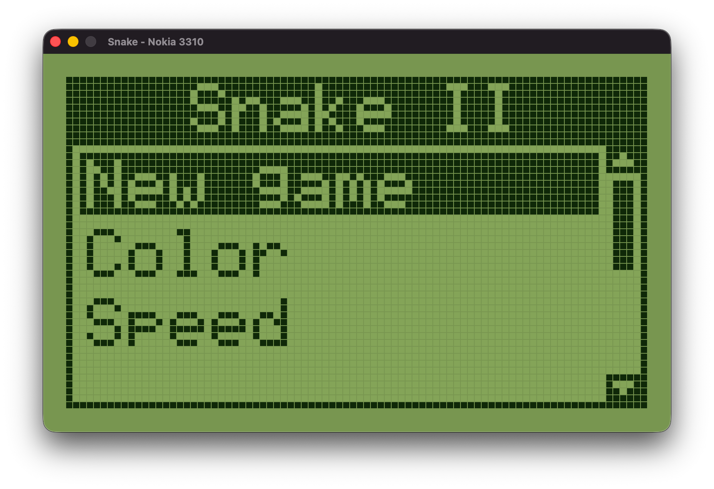
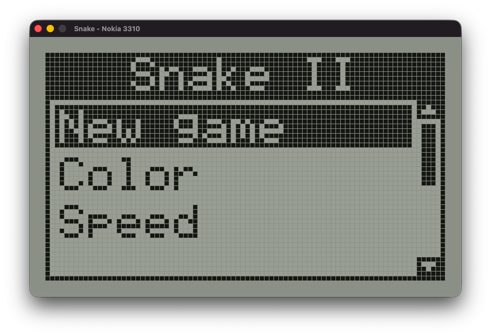
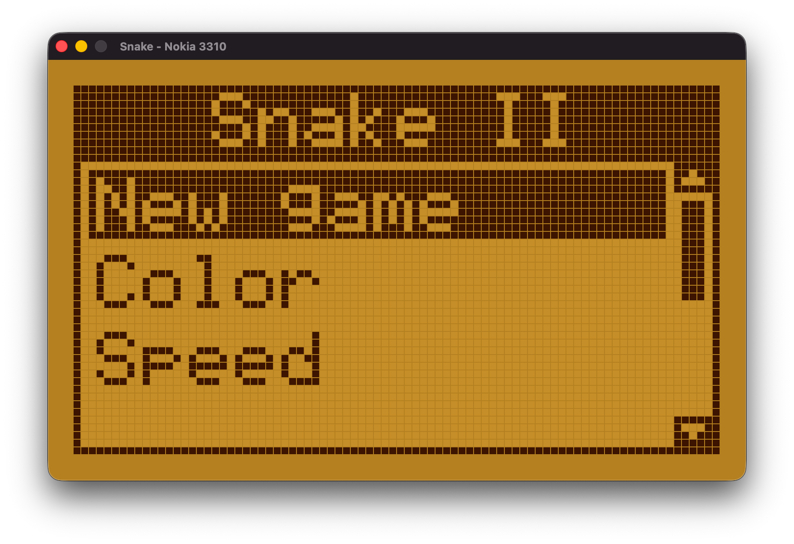

# Retro Snake

A faithful recreation of **Snake II** from the Nokia 3310, written from scratch in C99.

Every pixel of the original 84x48 monochrome LCD is simulated — the sprites, the fonts, the green backlight, the scrolling menus. It runs as a native GUI window (Raylib) or directly in your terminal using Unicode block characters.

[](https://youtu.be/evuz6vnfXrQ)

## Features

- **Pixel-perfect Nokia 3310 aesthetic** — 4x4 sprites, bitmap font, 84x48 LCD framebuffer
- **Three color palettes** — Green (classic), Grey, and Amber
- **Two rendering targets** — GUI window and terminal (same game, same menus, same look)
- **Synthesized sound effects** — eat, bonus, game over, menu navigation (GUI version)
- **Full menu system** — color selection, speed (7 levels), volume, credits
- **Pause menu** — resume, restart, back to menu, exit
- **Bonus system** — special items spawn every 5 foods with a countdown timer
- **141 tests** — covering game logic, LCD, sprites, renderer, and UI state machine

## Screenshots

| Green (classic) | Grey | Amber |
|:---:|:---:|:---:|
|  |  |  |

The GUI window renders the LCD framebuffer as a pixel grid with configurable palettes, matching the Nokia 3310 screen down to the pixel gaps. The terminal version renders the same 84x48 framebuffer using Unicode half-block characters (`▀`) with 256-color ANSI codes — same menus, same sprites, same look.

## Building

### Terminal version (no dependencies)

```bash
make -C src/ports/pc
./src/ports/pc/snake
```

Requires a POSIX system and a terminal with at least 84 columns and 256-color support.

### GUI version (requires Raylib)

```bash
brew install raylib    # macOS
make -C src/ports/pc-gui
./src/ports/pc-gui/snake-gui
```

### Tests

```bash
make -C test
```

## Controls

| Key            | Action              |
|----------------|----------------------|
| `W` / `↑`     | Move up              |
| `S` / `↓`     | Move down            |
| `A` / `←`     | Move left            |
| `D` / `→`     | Move right           |
| `Enter`        | Confirm / Pause      |
| `Esc`          | Back                 |
| `Q`            | Quit                 |

## Architecture

The codebase strictly separates platform-independent logic from platform adapters:

```
src/
  core/            Zero platform dependencies
    game.h/c       Game state, collisions, scoring, bonus system
    snake.h/c      Snake data structure and movement
    lcd.h/c        84x48 1-bit framebuffer
    sprites.h      4x4 pixel sprites and bitmap font
    renderer.h/c   Game frame, menu, and pause rendering
    ui.h/c         UI state machine (menus, transitions, settings)
    theme.h/c      Color palettes (Green, Grey, Amber)

  platform.h       Interface every port must implement
  ports/
    pc/            Terminal — ANSI escape codes, Unicode half-blocks
    pc-gui/        GUI — Raylib pixel grid with synthesized audio
```

Ports are thin adapters (~100 lines each). They implement `platform_present()` to display the framebuffer, `platform_get_input()` to poll keys, and a few timing/audio functions. The game loop, menus, and all rendering live in core.

Adding a new port (SDL, web/emscripten, embedded) means implementing 8 functions from `platform.h` — no game logic required.

## Technical Details

- **C99** with `-Wall -Wextra -Werror`
- **Zero heap allocation** — everything on the stack with fixed-size arrays
- **Zero external files** — no asset loading, sprites and fonts are compiled in
- **Terminal rendering** — handles non-blocking pty writes (`O_NONBLOCK` propagation from stdin), 256-color fallback with truecolor opt-in via `COLORTERM`

## Built with AI

This project was built entirely with [Claude Code](https://claude.com/claude-code) (Claude Opus 4.6) — from architecture design and game logic to sprite data, terminal rendering, and test suite. Every line of code was generated through iterative prompting and reviewed in real time.

## License

MIT
